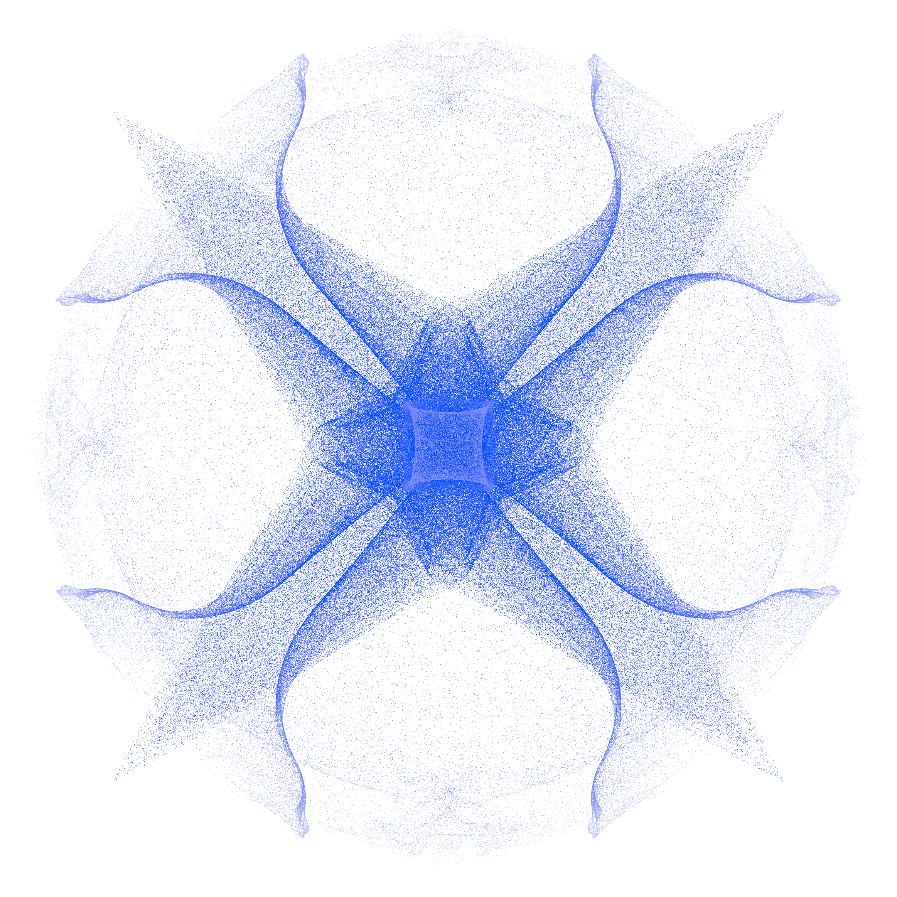

# Particle system

Goal of this project is to create particle system, using OpenCL and OpenGL.
I've implemented usual stuff like attractors and repellers,
but also created special objects : emitters and consumers.
Just a little nice-looking project. 

## Build

Install these packages with BREW :
```
brew install glew
brew install glfw
```
Then build the program :
```
cd build
make
```

## Usage

To run the program :
```
./build/particle_system
```
Program takes several optional flags :

```--demo=[demo letter]``` : choose a demo map (a-d)

```--map=[map file]``` : specify JSON file used by program as map

```--resolution=[width],[height]``` : set resolution of window

```--fps``` : display FPS

```--fast``` : lower quality, increase performance

```--help``` : get list flags and keys

## Features

* Free camera 
* Color interpolation according to particle's speed
* Initialization of particles in shape of tetrahedron
* Additional objects : emitter, consumer

## References

* [Coding Challenge: Attraction and Repulsion Forces](https://www.youtube.com/watch?v=OAcXnzRNiCY) - simple tutorial on particle system
* [Combining OpenCL and OpenGL](https://livebook.manning.com/book/opencl-in-action/chapter-15/146) - tutorial on OpenCL, OpenGL Interoperability 